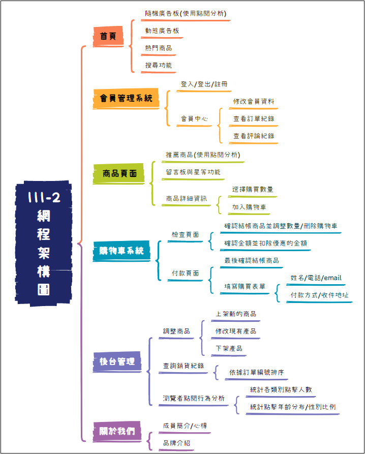
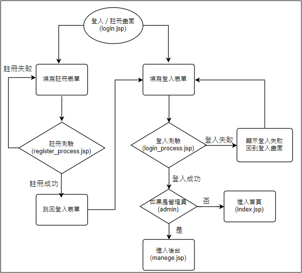
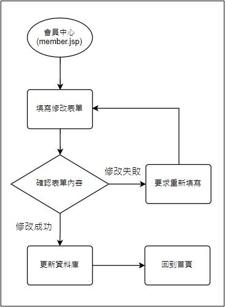
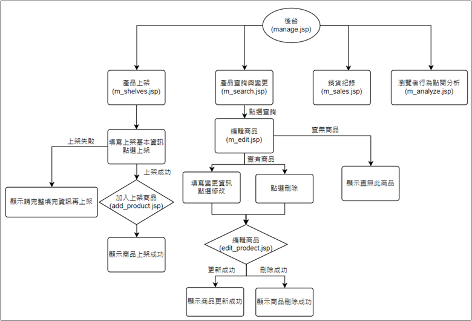
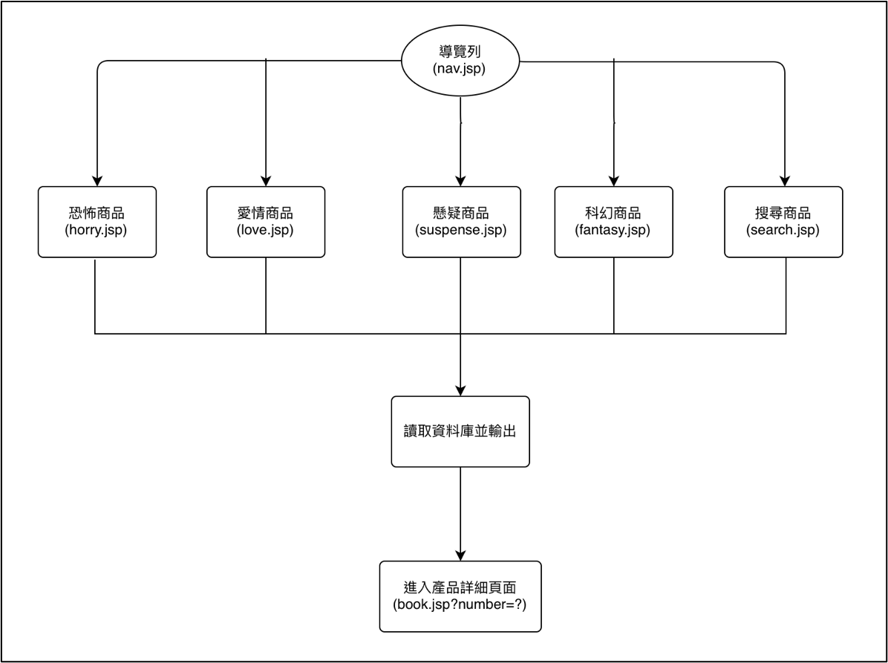
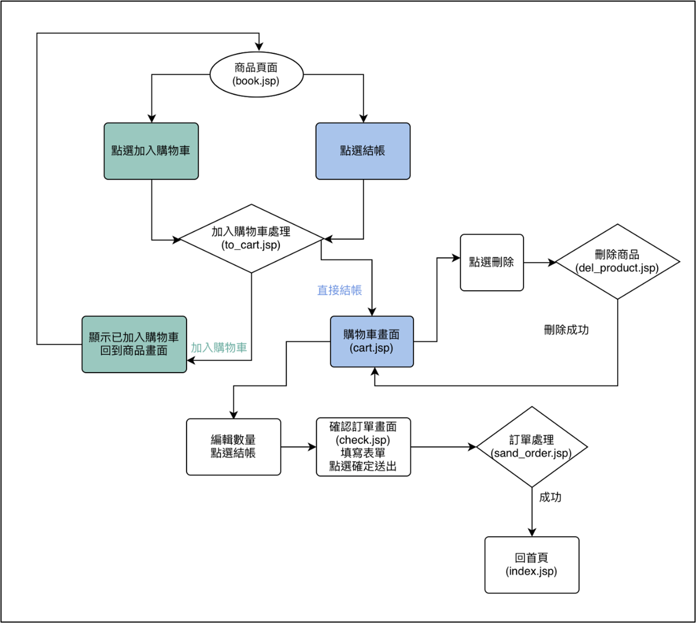
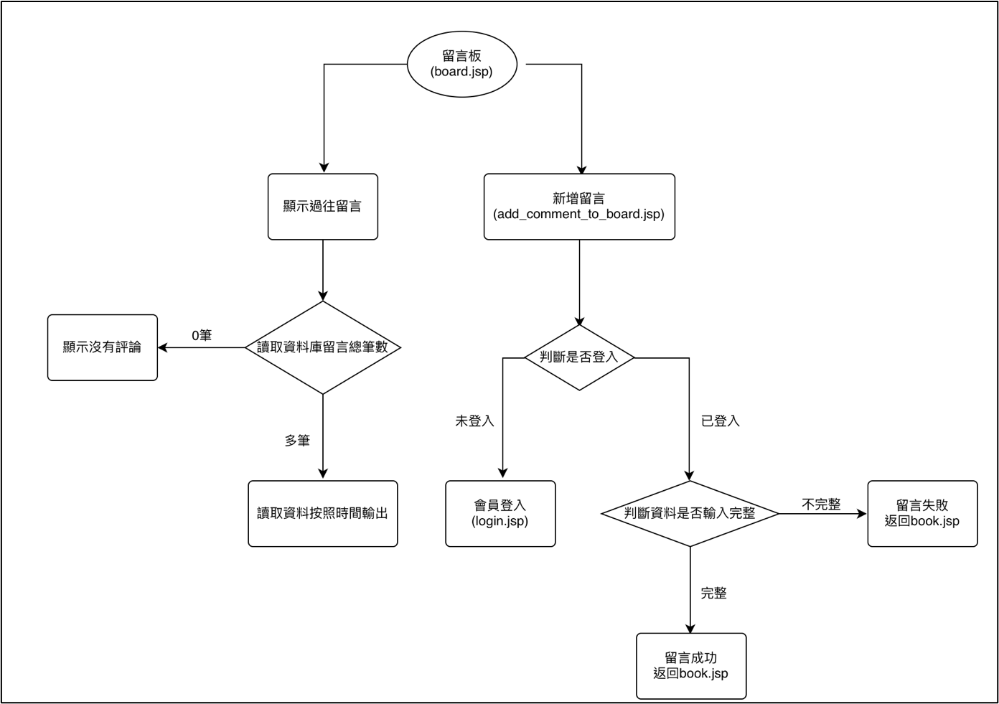
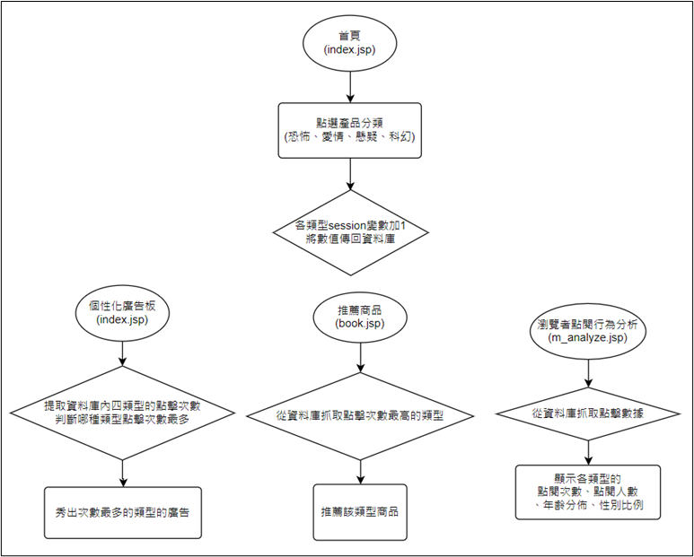

# 看Bar！網路書店
#### 網站連結(僅前端展示)：https://karaliang.github.io/BookBar/product.html

### 一、系統架構圖
 

### 二、操作說明與流程圖

#### 1.會員管理
- 登入說明：填寫帳號（email）、密碼之後點選登入之後會透過登入驗證處理的流程檢驗帳號和密碼是否正確，如果正確的話就會根據使用者的身分選擇進入首頁或後台管理頁面，否則回到登入頁面。目前此系統的設定只有管理員可以進入後台的頁面，其餘使用者都會在登入之後直接進到首頁並維持登入狀態。
- 註冊說明：讓使用者填寫必要資料，包含帳號名稱、電子郵件、密碼、生日、電話號碼、地址等資訊，待註冊者填寫完表單後送出，會進入註冊處理的流程，在此之前會先驗證表單中的欄位是否都已經填寫。如果使用者的電子郵件已經出現在會員資料庫中會顯示已經有重複的帳號申請，並請使用者更換電子郵件，註冊一切順利的話就會進入登入的表單讓新註冊的使用者進行登入的動作。
- 修改會員資料：修改會員資料的表單放在會員中心中，在後端則是另外包成一個jsp檔案儲存，使用者填寫修改的資料並送出會先進行欄位是否有填寫的驗證，如果有欄位為空會提醒使用者需要填寫資料。送出時會檢查表單中的email有沒有跟其他使用者重疊，一切順利後就會依序將表單內的資料更新到資料庫中。

     
     

 

#### 2.後台管理
管理員登入時會被系統偵測到，進而導向到後台管理的頁面
- 產品上架：將m_shelves內容打包傳向add_product.jsp。第一步先判斷每一個參數都不為空，若為空跳回m_shelves.jsp。若有完整接收則進入第二個判斷，與資料庫對比若有相同產品(利用ISBN判斷)則跳出失敗並返回m_shelves.jsp；若沒有即成功新增產品。
- 查詢現有產品資訊：進入m_search.jsp將搜尋內容打包向m_edit.jsp傳遞，可以對比product_id、ISBN與書名，前兩者為精確搜尋，後者為模糊搜尋，若符合條件輸出完整書本資訊，若不符合即輸出「查無此商品」。而在輸出產品資訊時隱藏產品欄位(避免誤改、資安問題並方便抓取是哪一本書)，另外產品類型由於是select type，因此運用ArrayList來輸入並比對應該selected哪一個類型，最後選擇是刪除或是修改再將資料打包傳向edit_product.jsp
- 修改與刪除現有商品：收到資料後首先(1)判斷是否要刪除商品，是的話將資料庫商品刪除並回傳刪除成功。反之(2)判斷是否每一個參數都不為空除了照片路徑，若未填寫完成跳回m_edit.jsp(已鍵入搜尋條件)，最後判斷(3)照片路徑是否更改分別選擇不同sql寫法insert資料。會造成如此繁複的判斷是由於input=”file”的存在並沒有預設value因此需要去判斷有沒有重新上傳。
- 銷貨紀錄：進入 m_sales.jsp 將資料庫order內容依據下單日期排序一一讀出並顯示。顯示欄位有：訂單編號、下單時間、訂單狀態、每筆商品的商品的購買數量、金額、所有商品的小計、優惠、合計(折扣後)。
- 瀏覽者點閱行為分析：進入 m_analyze.jsp，計算各類型點擊次數、點擊人數，並從資料庫呼叫預存程序(stored procedure)來抓到各類型年齡分佈與性別比例，畫面則是利用Google Charts的柱狀圖(年齡分佈)與圓餅圖(性別比例)呈現。

 

#### 3.商品頁面與搜尋
- 商品頁面說明：透過nav去選擇欲達到的產品分類頁面。由於前端使用表格來呈現商品排列頁面（一行四本），因此相對對邏輯作出調整。以horry.jsp為例，先讀取恐怖類別總共有幾本書，再運用迴圈判斷當前讀取到第幾本書，每一行的第一本除了要輸出商品本身還要加上<tr>，而第四本則是要加上</tr>。接著點選商品即可導向商品詳細資訊頁面(book.jsp?number=productid)
- 搜尋商品說明：在nav提供商品搜尋並限制只能輸入中英文與數字，輸入內容後會藉由search.jsp抓取輸入內容，接著與資料庫內容比對，讀取符合條件的總筆數，再運用迴圈與商品類別類似的手法輸出結果。
 

#### 4.購物車
- 判斷是否登入： 在主頁(index.jsp)點購物車icon，若未登入則顯示[請先登入！]，若登入則成功進入cart.jsp。
- 用加減按鈕調整數量： 在商品頁book.jsp以及購物車頁 cart.jsp皆可藉由加減按鈕調整購買數量。
- 兩種模式 [ 加入購物車、直接購買 ] ： 點加入購物車會將商品加進購物車(to_cart.jsp)並跳回原先商品頁面。點直接購買則會將商品加進購物車 (to_cart.jsp) 並跳至購物車頁面cart.jsp 。
- 判斷庫存數量： 若無庫存，則無法購買。讓加減數量按鈕控制在大於0且不大於庫存數量，防止購買數量在後面下訂時會出現的數量有誤的問題。
- 購物車永久保存於資料庫： 將每位會員的購物車資料都存放在資料庫裡，因此登出過後，還是可以永久保留原先的購物車，只要再次登入就可以了。
- 優惠活動(有折扣)： 優惠活動為全館9折。購物車頁面(cart.jsp)與結帳前確認頁面(check.jsp)皆有扣除優惠折扣。
- 刪除購物車商品： 在購物車頁面(cart.jsp)可針對想刪除商品，點選刪除icon，則會以(delete_cart.jsp)進行刪除的處理。
- 下訂前的購買表單：在結帳前確認頁面(check.jsp)，需要購買人填寫購買表單，表單欄位會從資料庫提取此購買人的基本資訊，購買人在填寫資料時會更加方便迅速。確認購買商品數量金額無誤，且填好表單後，就可以點確認送出，進行提交訂單的動作(sand_order.jsp)。

 

#### 5.留言版
- 顯示留言：沿用number抓取資料庫已存在的評論內容總筆數，若為0輸出目前無評論，反之依照留言日期讀取輸出。
- 新增留言：若未登入將跳轉登入頁面，而沒有填完完整資訊則要求重新填寫，最後上述條件皆有達成則新增成功。
 

#### 6.使用者點閱分析與推薦系統
說明：此表統計每個會員在各類別的點擊次數。應用於個性化廣告板、推薦商品、使用者點閱分析。

- 資料搜集：利用session在瀏覽器中的特性，只要有一位使用者點進了某一項類別頁面(例如：horry.jsp,love.jsp...)或是某類型書籍(例如恐怖類型書籍：book.jsp?number=1)就會讓該類型點閱次數加一。
- 資料運用：
    - (a)	個人化廣告：以使用者點閱次數預測他 / 她感興趣的類型，投放相對應的個人化廣告，提高消費者的購買率。
    - (b)	推薦商品：以使用者點閱次數預測他 / 她感興趣的類型，投放相對應類型的商品，提高消費者的購買其他商品的機率。
    - (c)	使用者點閱分析：利用google的chart套件將點閱的人數、次數、年齡與性別等資料利用SQL中view, procedure等方法繪製出圖表，放在網頁中對應的欄位上。藉此可知道某類型商品的潛在客戶為哪些族群。
 

### 三、JSP程式列表清單

#### 1.統整性程式
- 統一建立資料庫連線：setsql.jsp
- 導覽列：nav.jsp(搜尋含SQL Injection)
- 頁尾：footer.jsp

#### 2.首頁
- 首頁：index.jsp

#### 3.會員管理系統
- 登入與註冊：login.jsp
- 登入處理：login_process.jsp (含SQL Injection)
- 註冊處理：register_process.jsp (含SQL Injection)
- 登出：logout.jsp
- 修改會員資料處理：update_profile_process.jsp (含SQL Injection)

#### 4.會員中心
- 會員中心總覽：member.jsp
- 修改會員資料：update_profile_data.jsp (含SQL Injection)
- 會員訂單紀錄：member_order.jsp
- 會員評論紀錄：member_comment.jsp (含Stored Procedure)

#### 5.後台管理
- 後台管理總覽：ｍanage.jsp
- 產品上架頁面：m_shelves.jsp
- 上架產品處理：add_product.jsp (含SQL Injection)
- 產品查詢： m_search.jsp
- 產品變更：m_edit.jsp
- 產品變更處理：edit_product.jsp (含SQL Injection)
- 銷貨紀錄頁面：m_sales.jsp
- 瀏覽者點閱行為分析：m_analyze.jsp (含Stored Procedure)

#### 6.商品頁面、推薦商品與搜尋
- 恐怖類書籍：horry.jsp
- 愛情類書籍：love.jsp
- 懸疑類書籍：suspense.jsp
- 科幻類書籍：fantasy.jsp
- 商品詳細資訊：book.jsp (含SQL Injection)
- 加入留言板：add_commemt_to_board.jsp (含SQL Injection)
- 留言板：board.jsp (含SQL Injection)
- 推薦商品：recommend.jsp
- 搜尋結果：search.jsp (含SQL Injection)

#### 7.購物車系統
- 加入購物車的處理：to_cart.jsp (含SQL Injection)
- 顯示購物車：cart.jsp
- 刪除購物車：delete_cart.jsp (含SQL Injection)
- 確認訂單、填寫基本資訊：check.jsp
- 訂單處理：sand_order.jsp (含SQL Injection)

#### 8.關於我們頁面
- 關於我們頁面：about_team.jsp
